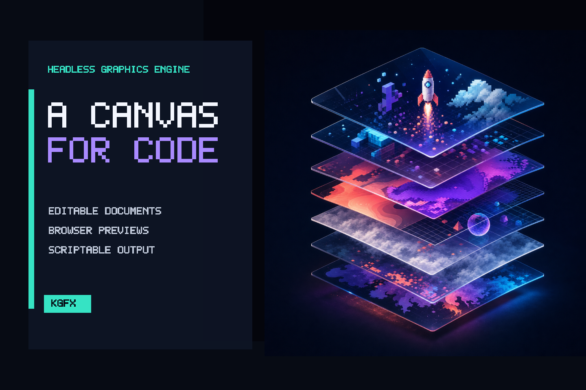
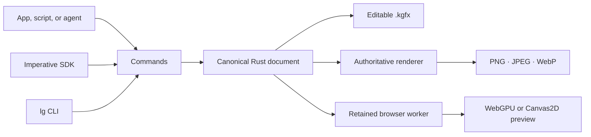

# Layered Graphics



Layered Graphics is an experimental, open-source engine for creating editable layered graphics from applications, browser workers, scripts, and AI agents. It provides a portable `.kgfx` document, one command model across runtimes, deterministic exports, and retained browser previews—without prescribing an editor UI.

The current release can build, inspect, revise, diff, and render compositions made from images, bitmap text, solid fills, and groups. PNG, JPEG, and WebP export are supported. Masks, shapes, painting, selections, and effects are not implemented yet.

> Alpha software: document and command schemas are versioned, but the public API may change before v1.

## See it work

The image above is not a mockup. [`examples/showcase`](examples/showcase/) combines an original raster source with engine-authored fill, image, text, blend, transform, asset, and ordering operations, then exports the PNG and editable [`showcase.kgfx`](apps/site/public/showcase.kgfx).

```bash
rustup target add wasm32-unknown-unknown
cargo install wasm-bindgen-cli --version 0.2.126 --locked
corepack enable
pnpm install

./examples/showcase/build.sh
pnpm test
```

Explore the [documentation](https://iamkaf.github.io/layeredgraphics/docs/), run the [in-browser rendering proof](https://iamkaf.github.io/layeredgraphics/playground/), or inspect the [benchmark results](docs/BENCHMARKS.md).

## Install a release

After the first registry release:

```bash
npm install @layered-graphics/core @layered-graphics/browser
cargo install layered-graphics-cli
```

GitHub Releases also provide prebuilt `lg` binaries for Linux, macOS, and Windows, plus checksums, schemas, and editable examples. See the [release operator guide](docs/RELEASING.md) for the automated version and publication process.

## What works today

| Area | Current capability |
| --- | --- |
| Documents | Versioned `.kgfx` ZIP container, stable IDs, embedded/linked assets, namespaced extensions, schema migration |
| Editing | Atomic commands, transactions, changesets, undo/redo, supported-state diffing, imperative TypeScript helpers |
| Layers | Raster images, solid fills, bitmap-font text, nested groups, visibility, opacity, transforms, normal/multiply blend |
| Output | Authoritative PNG, JPEG, and WebP; nearest and smooth sampling; scaled and isolated-layer render |
| Automation | Native `lg` CLI, Rust core, browser WASM API, native Node API, JSON inspection and diagnostics |
| Browser | Module-worker sessions, retained sources, dirty-region reporting, quality tiers, cancellation, warm batches, WebGPU/Canvas2D presentation |
| Robustness | Bounded container loading, hash validation, safe archive paths, atomic replacement, cross-runtime conformance tests |



## One document, one command language

Every mutation uses the same validated operation protocol:

```ts
doc.execute([
  {
    op: "layerAdd",
    layer: {
      id: "hero",
      type: "image",
      assetId: "hero-image",
      opacity: 0.7,
      blendMode: "multiply",
    },
  },
]);
```

The imperative API compiles to those operations:

```ts
const hero = doc.layers.add({
  id: "hero",
  type: "image",
  assetId: "hero-image",
});

hero.update({ opacity: 0.7, blendMode: "multiply" });
```

The native CLI exposes the same behavior to humans and agents:

```bash
lg new card.kgfx --width 1200 --height 630 --dpi 144
lg asset add card.kgfx --id hero ./hero.png
lg layer add card.kgfx --type image --id hero-layer --asset-id hero
lg layer update card.kgfx hero-layer --set opacity=0.7 --set blend=multiply
lg inspect card.kgfx --json
lg render card.kgfx -o card.webp --format webp
```

Use `lg --help` for the complete command surface. The [CLI guide](apps/site/src/content/docs/docs/cli.md), [`.kgfx` specification](docs/spec/kgfx-v1.md), and [command specification](docs/spec/commands-v1.md) document the current contract.

## Repository map

```text
crates/lg-core       canonical document, container, history, inspection, rendering
crates/lg-cli        native lg command-line interface
crates/lg-wasm       WebAssembly bindings
crates/lg-node       native Node bindings
packages/core        TypeScript/WASM SDK
packages/browser     retained worker and preview presentation
packages/node        native Node package
apps/site            Astro landing page, Starlight docs, browser proof
examples             reproducible editable compositions
spec                 generated document and command schemas
```

The architecture is Rust + WebAssembly + TypeScript + WebGPU, in a Cargo/pnpm monorepo. See [Technology Stack](docs/TECH_STACK.md) and [runtime support](docs/API_SUPPORT.md).

## Lean roadmap

1. **Milestone 2:** power a template-driven artwork studio with editable shapes, gradients, production text, fitted and clipped images, and PNG/SVG export.
2. Expand the graphics vocabulary with masks, blend modes, adjustments, filters, selections, and paint.
3. Add framework-neutral hit testing, transforms, snapping, clipboard, and input controllers, then harden production integrations and stabilize v1.

See the [Milestone 2 definition](docs/MILESTONE_2.md), [roadmap](docs/ROADMAP.md), and [implementation plans](docs/plans/) for scope and acceptance criteria.

## Contributing

Issues and pull requests are welcome. Start with [CONTRIBUTING.md](CONTRIBUTING.md), follow the [Code of Conduct](CODE_OF_CONDUCT.md), and report vulnerabilities through [SECURITY.md](SECURITY.md).

Layered Graphics is available under the [MIT License](LICENSE).
