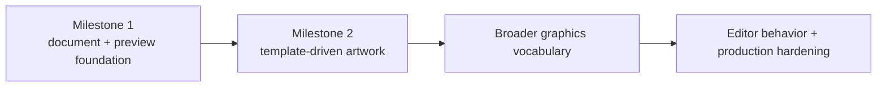

The repository's normative high-level roadmap is [`docs/ROADMAP.md`](https://github.com/iamkaf/layeredgraphics/blob/main/docs/ROADMAP.md).

The executable-document and browser-rendering foundations are complete. The project creates and renders editable showcase graphics through the public CLI, executes one command model in browsers and native Node, and proves retained worker rendering against cold authoritative output.

Milestone 2 is a template-driven artwork workflow: structured recipes compile into editable shapes, paths, gradients, production text, and fitted or clipped images, with PNG and SVG output from the same document. It is an application-level proof that deliberately precedes selections, painting, filters, and general-purpose editor interaction.

Read the complete [Milestone 2 definition](https://github.com/iamkaf/layeredgraphics/blob/main/docs/MILESTONE_2.md) for its integration boundary, workflow, verification, and exit criteria.
