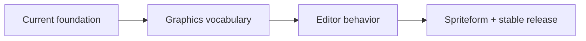

The repository's normative high-level roadmap is [`docs/ROADMAP.md`](https://github.com/iamkaf/layeredgraphics/blob/main/docs/ROADMAP.md).

The executable-document and browser-rendering foundations are complete. The project creates and renders editable showcase graphics through the public CLI, executes one command model in browsers and native Node, and proves retained worker rendering against cold authoritative output. Work now moves through graphics primitives, editor behavior, and Spriteform production proof.

