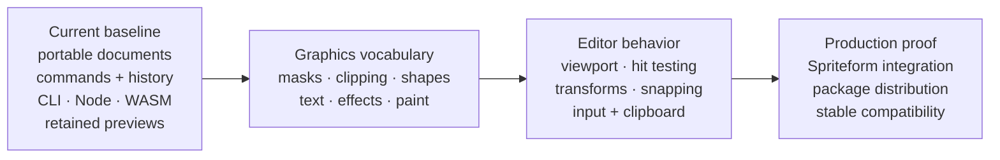

# Roadmap

Layered Graphics already has an executable document engine, native and browser APIs, authoritative export, and retained browser previews. The remaining path is organized around three user-visible outcomes rather than a feature countdown.

## Current baseline

Completed on 2026-07-12 and protected by CI:

- `.kgfx` v1 container and JSON schemas, safe loading, schema-0 migration, embedded and linked assets
- canonical Rust command reducer, atomic transactions, changesets, history, inspection, supported-state diffing
- image, fill, bitmap-text, and group layers with visibility, opacity, transforms, normal/multiply compositing
- authoritative PNG/JPEG/WebP export through Rust, CLI, native Node, and browser WASM
- retained worker previews with invalidation metrics, quality intents, cancellation, recovery, warm batches, and WebGPU/Canvas2D presentation
- cross-runtime fixtures, visual workflow proofs, and checked performance budgets

The concise [completion record](FOUNDATION_AUDIT.md) links to the executable evidence.

## Graphics vocabulary

The next outcome is a coherent Photoshop-like editing vocabulary. Work is sliced vertically so each addition includes persistence, commands, inspection, history, preview, export, docs, and conformance coverage.

Recommended sequence:

1. group isolation, broader blend coverage, raster masks, clipping chains
2. editable shapes, gradients, and production text/font handling
3. adjustments and bounded filters
4. selections and selection-aware raster operations
5. brush strokes, fill, destructive raster actions, alignment helpers

Exit signal: an agent can create and revise a polished composition using public interfaces while every primitive remains editable. See [Graphics Primitives](plans/03-graphics-primitives.md).

## Editor behavior

The engine then gains unstyled, framework-neutral interaction controllers: viewport coordinates, hit testing, selection, transforms, guides, snapping, keyboard actions, clipboard, paint input, and history grouping.

Exit signal: an application developer can assemble a useful custom browser editor without duplicating geometry or gesture semantics. See [Editor Toolkit](plans/04-editor-toolkit.md).

## Production proof

Spriteform becomes the primary integration case. Its smart layers and variant rules stay application-owned while Layered Graphics handles compositions, previews, history, and export. The same cycle hardens package distribution, migrations, diagnostics, resource limits, examples, and release policy.

Exit signal: Spriteform uses the engine on supported paths, batch thumbnail generation is bounded and observable, and the public packages meet a documented prerelease or stable release gate. See [Integration and Hardening](plans/05-integration-hardening.md).

## Continuous tracks

- The [site and documentation](plans/06-website-documentation.md) describe shipped behavior and host runnable proofs.
- Each primitive extends conformance fixtures and performance workloads.
- `.kgfx` files and assets remain untrusted input with explicit limits and deterministic failures.
- Intentional Photoshop differences are documented; compatibility is never implied by naming alone.

## Outside the v1 path

PSD import/export, CMYK print workflows, animation timelines, 3D scenes, built-in multi-user collaboration, and a prescribed styled editor are not v1 goals.
