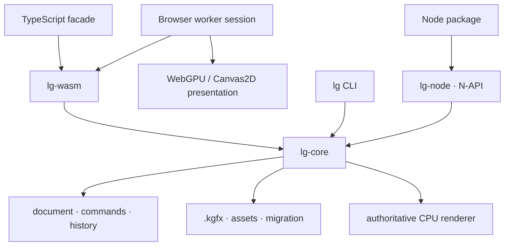

# Technology stack

This document records the implemented architecture and the boundaries new work must preserve.

## Runtime map



## Repository

Layered Graphics is one Cargo and pnpm monorepo:

```text
crates/lg-core       canonical state, commands, persistence, inspection, rendering
crates/lg-cli        native filesystem-oriented CLI
crates/lg-wasm       wasm-bindgen boundary
crates/lg-node       napi-rs native Node boundary
packages/core        TypeScript document API and generated WASM artifact
packages/browser     worker protocol, retained session, preview presenter
packages/node        native loader and high-level Node facade
apps/site            Astro/Starlight website and executable browser proof
spec                 generated JSON schemas
fixtures             migrations and conformance policy
benchmarks           checked results and budgets
```

The root scripts coordinate shared checks without hiding the underlying Cargo and pnpm commands.

## Rust core

Rust owns behavior that must agree across CLI, Node, and browser runtimes:

- canonical document state and validation
- command reduction, transactions, changesets, revisions, history, and diffing
- `.kgfx` containers, assets, integrity, migration, and resource limits
- structured inspection and diagnostics
- retained source caching and invalidation
- authoritative compositing and PNG/JPEG/WebP export

`lg-core` is platform-neutral where possible. Filesystem policy lives in the CLI or host bindings; linked asset bytes are supplied by the host.

The workspace uses stable Rust, edition 2024. Dependencies provide codecs (`image`), raster operations (`tiny-skia`), bitmap-font rasterization (`fontdue`), containers (`zip`), schemas (`schemars`), serialization (`serde`), and error/CLI infrastructure.

## WebAssembly and TypeScript

`lg-wasm` exposes a small session-oriented wasm-bindgen surface. `@layered-graphics/core` wraps it with strict TypeScript types, lifecycle management, command execution, imperative helpers, history, inspection, serialization, linked assets, and rendering.

Large binary payloads use typed arrays. Browser workers keep the hot document/render loop on one side of the boundary. Generated WASM bindings are checked into the package and verified for drift in CI.

The TypeScript layer does not implement document mutation or compositing rules. Imperative helpers compile to public commands handled by Rust.

## Native Node and CLI

`@layered-graphics/node` loads a napi-rs native module and provides the same document-oriented API shape for high-throughput Node workflows. Contract tests execute shared operation fixtures in native Node and browser WASM.

`lg` is a Rust executable built directly on `lg-core`. It provides file creation, command execution, layer/asset/extension mutation, history, diffing, inspection, validation, schema output, rendering, and retained watch workflows. JSON output and exit behavior are automation surfaces.

## Rendering

### Authoritative path

The CPU renderer defines supported output semantics and produces final PNG, JPEG, WebP, raw RGBA, and conformance expectations. It supports the current image, fill, bitmap-text, and group sources with ordering, transforms, opacity, visibility, and normal/multiply blend.

### Browser preview path

The browser package keeps canonical execution and retained rendering in a module worker. A transferred `OffscreenCanvas` uses WebGPU when available and Canvas2D otherwise. Without a canvas, the worker returns transferable RGBA.

WebGPU composites retained top-level sources with straight-alpha normal/multiply equations. Isolated group sources and authoritative/raw output remain Rust-composited. Interactive resolution and GPU filtering may approximate authoritative output according to documented quality tiers.

Four intents—`interactive`, `preview`, `refined`, and `authoritative`—control resolution and fidelity. Sessions expose dirty regions, invalidation reasons, cache activity, cancellation, recovery, and bounded warm batches.

## Document and schemas

`.kgfx` is a ZIP-compatible container with a versioned JSON manifest and content-addressed assets. Archive layout is private; callers use the specification and APIs. Loading validates paths, declared sizes, hashes, limits, schema versions, and linked-asset metadata.

Rust types generate the checked JSON schemas in `spec/document` and `spec/commands`. CI regenerates and rejects drift. TypeScript definitions mirror the public contract through generated bindings and compile-time checks.

## Website

Astro provides the custom landing page and static build. Starlight supplies accessible documentation navigation, code presentation, sitemap, and Pagefind search. Interactive proof pages load the same workspace WASM/browser packages used by consumers. Playwright exercises the production build.

## Dependency and capability policy

Libraries are preferred for well-tested primitives when they meet browser/WASM compatibility, performance, FOSS licensing, maintenance, and input-hardening requirements. Public APIs describe Layered Graphics concepts rather than leaking dependency-specific types.

Optional capabilities must degrade explicitly. CPU/WASM remains the functional fallback when WebGPU is absent. New graphics features declare persistence, command, inspection, history, invalidation, preview, authoritative output, cross-runtime, performance, and documentation behavior before they are called supported.
